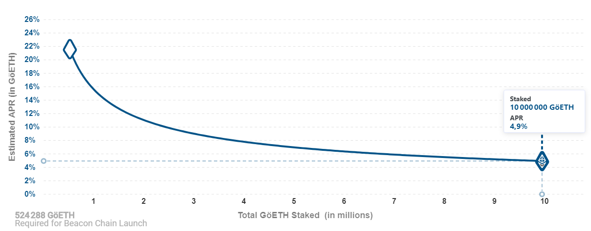

# ETH2 Staking with Prysm and Lighthouse in AWS (and with Raspberry)

> Staking ETH2 on server in AWS cloud: for better performance/availability, recommanded for mainnet (this guide below vv)

> For Raspberry Pi staking (testing purpose, see this [guide](raspberry_setup.md))

**Your takeaways from this post**
- Deploy a client (Prysm or Lighthouse) to stake Ethereum in testnet (medalla)
- Semi automated infrastructure deployment (terraform, cloud-config, AWS, snapshot)
- A setup to obtain high security for your funds
- Some basic monitoring and steps to fix commum issues

## Introduction

Ethereum 1.x is migrating to [Ethereum 2.0](https://ethereum.org/en/eth2/) in few months (before 2021 hopefully), starting with [Phase 0](https://ethereum.org/en/eth2/#roadmap).
This first upgrade will enable [proof of stake](https://ethereum.org/en/eth2/#proof-of-stake). It means you will be able to lock your ETH1 in order to validate the Ethereum 2.0 network and win rewards for that: `ROI = 4 to 22%`, depending on the number of ETH1 staked., following this distribution:




## Staking requisites

In order to stake, you will need:
- 32 ETH (a minimum in order to start staking, a multiple of 32ETH if you want to stake more)
- An Ethereum 1.0 nodes to access blocks:
  - [geth](https://geth.ethereum.org/): the most popular client in GoLang
  - [parity / openEtherem](https://www.parity.io/ethereum/): great alternative in Rust 
  - [Nethermind](https://nethermind.io/): .NET version, for enterprise mainly (new)
  - [Besu](https://www.hyperledger.org/use/besu): Java version (new)
  - Or a connection to a third party service like [infura](https://infura.io/)
- A staking ETH2 client: 
  - [Prism](https://github.com/prysmaticlabs/prysm): GoLand (most used)
  - [Lighthouse](https://github.com/sigp/lighthouse): Rust version (lighter and great alternative)
  - [Nimbus](https://our.status.im/tag/nimbus/): using Nim code, from Status.io team
  - [Teku](https://pegasys.tech/teku/): Java, for enterprise mainly

## Prerequites
- AWS account
- Terraform cli and cloud account (free)

## Our infra schematics
To be completed...

## Deploy server Infra 
- You can deploy Prysm or Lighthouse or both to have two different clients ready when bug arrive. Keep both beacon synced, **but do run only 1 validator at the time !!**
- Clone this repo and go to dir: `cd terraform/[lighthouse||prysm]` 
- Init: `terraform init`
- Plan: `terraform plan`
- Deploy: `terraform apply`
- If error `no valid credential sources for Terraform AWS Provider found`: don't forget to change `execution mode -> local` in [settings](https://app.terraform.io/app/gregbkr/workspaces/eth2-prysm-testnet/settings/general)
- Ssh on server: `ssh eth@<public_IP>`

## Run Prysm/Lighthouse Beacon
- Check that cloud-init is finished: `tail /var/log/cloud-init-output.log -n1000 -f`
- Run beacon with: `sudo systemctl start [prysm|lighthouse]-beacon`
- Check logs: `journalctl -u [prysm|lighthouse]-beacon -ef`

## Update to the latest version of the client
- Stop beacon: `sudo systemctl stop [prysm|lighthouse]-beacon`
- Pryms:
```
mkdir -p ~/prysm && cd ~/prysm && curl https://raw.githubusercontent.com/prysmaticlabs/prysm/master/prysm.sh --output prysm.sh && chmod +x prysm.sh && ./prysm beaconchain --version
```
- Lighthouse: check [release](https://github.com/sigp/lighthouse/releases)
```
export VERSION='v0.3.3'
wget https://github.com/sigp/lighthouse/releases/download/${VERSION}/lighthouse-${VERSION}-x86_64-unknown-linux-gnu-portable.tar.gz
tar -xvf lighthouse-${VERSION}-x86_64-unknown-linux-gnu-portable.tar.gz
sudo cp lighthouse /usr/local/bin
lighthouse --version
```
- Start beacon: `sudo systemctl start [prysm|lighthouse]-beacon`


## Validator key to store the 32 ETH
**Warning!**: before going further you need to **assure that your node is fully synced** and reached the last block listed on this [page](https://beaconscan.com/).

It is a good practive to open the [launchpad](https://medalla.launchpad.ethereum.org/) and read about the process.

### Create the seed
The most critical part is to create the validator key which will receive the funds (32+ ETH) and will validate block. Format a fresh USB stick to download the latest deposit CLI from [the official repository](https://github.com/ethereum/eth2.0-deposit-cli/releases/) (double check this link from this official documentation!!)

**On the secure and air-gapped laptop/raspberry**: 
- connect the USB stick to get the CLI, and run the command: 
```
./deposit --num_validators 1 --chain medalla
```
- You should provide a `keystore password` and the cli should output a seed like
```
cabbage garden word3 word4 .... word24
```
- And a directory structure like:
```
/home/myuser/Documents/eth2/validator_keys/validator_keys/
    |   deposit_data-1602056423.json                  # public key = the ETH address where you will send the 32 ETH (ok to share)
    |   keystore-m_12381_3600_0_0_0-1602056423.json   # private key (critical, do not share!!)

```
- Copy the `seed` and the `keystore password` on a piece of paper and keep it safe, this paper is CRITICAL as it contains the keys to recover the 32 ETH.
- Copy on your USB stick the validator keys located here: `/home/myuser/Documents/eth2/validator_keys`, and transfer them (via SCP) to your VPS server.

### Deposit 32 ETH
Follow again the [launchpad](https://medalla.launchpad.ethereum.org/), go to the section to deposit the 32 ETH. You should need to provide the file `deposit_data-1602056423.json` from your USD stick.

Send 32 ETH (Goerli testnet). **Do not send mainnet ETH, please check 3 times!**

## Run validator 
Please choose between, **BUT NOT BOTH !!**:

### Prysm validator
<details>
    <summary>Click to expand</summary>

Following this [doc](https://docs.prylabs.network/docs/testnet/medalla#step-5-import-your-validator-accounts-into-prysm):
- We will import the account from the USB stick.
```
/home/eth/prysm/prysm.sh validator --medalla accounts import --keys-dir=~/validator_keys
```
- Input your wallet password in a file to auto-unlock when you will run prysm-validator : `nano ~/.eth2validators/prysm-wallet-v2/wallet.password`
- And secure the permission: `chmod 600  ~/.eth2validators/prysm-wallet-v2/wallet.password` 
- Run validator: `sudo systemctl start prysm-validator`
</details>

### Lighthouse validator
<details>
    <summary>Click to expand</summary>

To be completed...
</details>

## Check deposit and validator status

- Check logs: `journactl -u prysm-validator -ef`
- You should see in logs: `Waiting for deposit to be observed by beacon node`, as it takes around 5 to 12h for your deposit to be active in the smart contract.
- Monitoring your validator status [beaconcha.in](https://beaconcha.in/validator/863592ae2c05450139c5ede142d734136c40f321f125d9312816094067b6ec2ff42451dfee2386461c6f7a6f9f328021) or [beaconscan.com](https://beaconscan.com/validator/0x863592ae2c05450139c5ede142d734136c40f321f125d9312816094067b6ec2ff42451dfee2386461c6f7a6f9f328021) (get your pubkey from `cat validator_keys/keystore-m_12381_3600_0_0_0-1604174082.jso`)

## Monitoring

### Prometheus

Install
```
wget https://s3-eu-west-1.amazonaws.com/deb.robustperception.io/41EFC99D.gpg | sudo apt-key add -
sudo apt-get install -y prometheus
# No need fo now... prometheus-node-exporter prometheus-pushgateway prometheus-alertmanager
```

For [Prysm](https://github.com/GuillaumeMiralles/prysm-grafana-dashboard)
```
cat << EOF > /etc/prometheus/prometheus.yml
global:
  scrape_interval:     15s # Set the scrape interval to every 15 seconds. Default is every 1 minute.
  evaluation_interval: 15s # Evaluate rules every 15 seconds. The default is every 1 minute.
  # scrape_timeout is set to the global default (10s).
# Alertmanager configuration
alerting:
  alertmanagers:
  - static_configs:
    - targets:
      # - alertmanager:9093
# Load rules once and periodically evaluate them according to the global 'evaluation_interval'.
rule_files:
  # - "first_rules.yml"
  # - "second_rules.yml"
# A scrape configuration containing exactly one endpoint to scrape:
# Here it's Prometheus itself.
scrape_configs:
  - job_name: 'beacon node'
    static_configs:
      - targets: ['localhost:8080']
  - job_name: 'validator'
    static_configs:
      - targets: ['localhost:8081']
  - job_name: 'slasher'
    static_configs:
      - targets: ['localhost:8082']
EOF
```
For [Lighthouse](https://github.com/sigp/lighthouse-metrics)

```
global:
  scrape_interval:     15s # Set the scrape interval to every 15 seconds. Default is every 1 minute.
  evaluation_interval: 15s # Evaluate rules every 15 seconds. The default is every 1 minute.
  # scrape_timeout is set to the global default (10s).
# Alertmanager configuration
alerting:
  alertmanagers:
  - static_configs:
    - targets:
      # - alertmanager:9093
# Load rules once and periodically evaluate them according to the global 'evaluation_interval'.
rule_files:
  # - "first_rules.yml"
  # - "second_rules.yml"
# A scrape configuration containing exactly one endpoint to scrape:
# Here it's Prometheus itself.
scrape_configs:
  - job_name: 'beacon node'
    static_configs:
      - targets: ['localhost:5054']
        labels: 
          job: 'nodes'
```

Then start prometheus: `sudo systemctl start prometheus`

### Grafana

```
sudo apt-get install -y adduser libfontconfig1
wget https://dl.grafana.com/oss/release/grafana_7.3.1_amd64.deb

sudo dpkg -i grafana_7.3.1_amd64.deb
sudo systemctl start grafana-server
```

- To connect to grafana from our local laptop via ssh tunnel: `ssh -N -L 3000:localhost:3000 eth@15.237.131.85` and browse localhost:3000
- Add new source > prometheus > http://localhost:9090
- import [dashboard](prym-grafana-dashboard.json)
- Connect telegram:
  - Talk to @Botfather in telegram, `/newbot`
  - Create a new group, and add your bot to it
  - Go to Grafana > Alerting > Notification channel 
  - Use API token you created before, Find ChatID with: `curl https://api.telegram.org/bot1300237440:AAFpmW6qy92UG8xYUjYBys1OoGhJcDXD0YY/getUpdates` (id:51321729) > Test


## Todo

DEV
- [x] Wait to validate [Prysm](https://beaconscan.com/medalla/validator/0xb2ded5d8f713db955d10ba4f24b325abfedd9d462983c03c3b487c47290e60135d9895f4c2d3d59c31dd21b36a525d4a)
- [x] Try validate on lighthouse (failed on raspberry)
- [ ] Simulate VM failure 
  - [ ] Same client (snapshot + key rebuild + timing)
  - [ ] Swith validator from Prysm to lighthouse
- [ ] Monitor status
- [ ] ETH1 node?
- [ ] Remote signer?

PROD
- [ ] Monitoring on another VM
- [ ] Lock ssh access
- [ ] Activate daily snapshot
