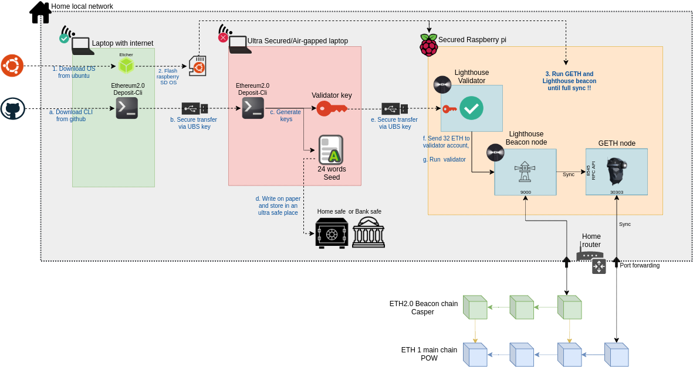

# eth2-staking
Ethereum 2.0 staking with lighthouse client, a secure setup on raspberry pi 4

Your takeaways from this post:
- Implement a client (lighthouse) to stake Ethereum
- Which infrastructure to buy to stake at home: rapsberry, harddrive, internet
- A setup to obtain high security for your funds
- Some basic monitoring and step to fix any issues

# Introduction

Ethereum 1.x is migrating to [Ethereum 2.0](https://ethereum.org/en/eth2/) in few months (before 2021 hopefully), stating with [Phase 0](https://ethereum.org/en/eth2/#roadmap).
This first upgrade will enable [proof of stake](https://ethereum.org/en/eth2/#proof-of-stake). It means you will be able to lock your ETH1 in order to validate the Ethereum 2.0 network and win rewards for that.

# Staking infrastructure requisits

In order to stake, you will need:
- 32 ETH (a minimum in order to start staking)
- An Ethereum 1.0 nodes to access blocks:
  - [geth](https://geth.ethereum.org/): the most popular client in GoLang
  - [parity / openEtherem](https://www.parity.io/ethereum/): great alternative in Rust 
  - Nethermind](https://nethermind.io/): .NET version, for enterprise mainly (new)
  - [Besu](https://www.hyperledger.org/use/besu): Java version (new)
  - Or a connection to a third party service like [infura](https://infura.io/)
- A staking ETH2 client: 
  - [Prism](https://github.com/prysmaticlabs/prysm): GoLand (most used)
  - [Lighthouse](https://github.com/sigp/lighthouse): Rust version (great alternative)
  - [Nimbus](https://our.status.im/tag/nimbus/): code in Nim, from Status team
  - [Teku](https://pegasys.tech/teku/): Java, for enterprise mainly

# Our secure setup

- **A laptop with internet** (in green): this is a simple PC to download package from internet, build the raspberry OS, and read this documentation
- **An ultra secured/air gapped laptop** (in red): this critical laptop needs to be trusted (don't use any PC you browsed internet in the past with) as it is generate all the keys for staking. It could be a the raspberry pi with another SD that you will format again when the keys are done
- **Hardware**: a simple raspberry + SSD is enough to run all the infra.
- **Internet connection**: we can run everything from house, as long as you have a good internet connection (speed and reliability)
- **ETH2 Staking client**: In our setup, we choose Lighthouse because Prysm represents [99%](https://eth2.ethernodes.org/network/Medalla) of the node on the medalla testnet, and we need client diversity in case of a bug, so the validation could continu on another version of the client.
- **ETH1 node**: we are using Geth for the Ethereum 1 node

# Hardware
- **[Raspberry 4 model B](https://www.raspberrypi.org/products/raspberry-pi-4-model-b/)** is powerfull and nicely cheap to run all infra. We opted for the 8GB version ($90). The 4GB could be enough ($60), but considering the price difference, it is good to have more RAM in case. For the OS, choose a 16GB SD card class 10.

- **External SSD storage to store blockchains**: geth and lighthouse will read/write lots of data, and the raspberry SD card is not made to handle such a load. External SSD [Samsung T7 1TB](https://www.digitec.ch/en/s1/product/samsung-portable-t7-black-1000gb-external-ssd-13199902?tagIds=76-535) is perfect to store all data. 500TB could be enough, but I did not want to be bother if the disk get full in 1 or 2 years. Today ETH1 data take ~300GB already.

- **Raspberry casing**: running a staking node will use 100% of your CPU, specially in the begining where data will sync. Temperature in my default case [OKDO](https://www.digitec.ch/en/s1/product/okdo-raspberry-pi-4-model-b-case-housing-electronics-supplies-casing-11268337) was 76°C, but raspberry should run under 70°C to not loose performance. I had to change for a [Flirc case](https://www.digitec.ch/en/s1/product/sertronics-flirc-housing-electronics-supplies-casing-12241821) to get 62°C. This is perfert, as no fan noise or maintenance will be needed.

# Keys
https://medalla.launchpad.ethereum.org/

https://github.com/ethereum/eth2.0-deposit-cli