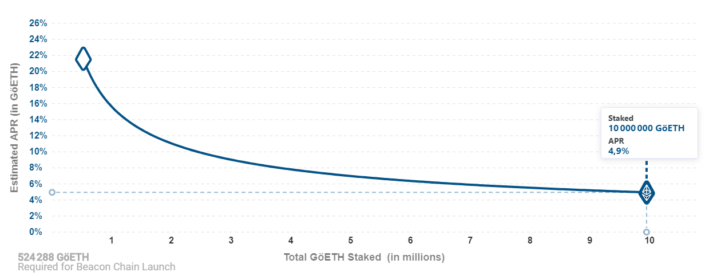
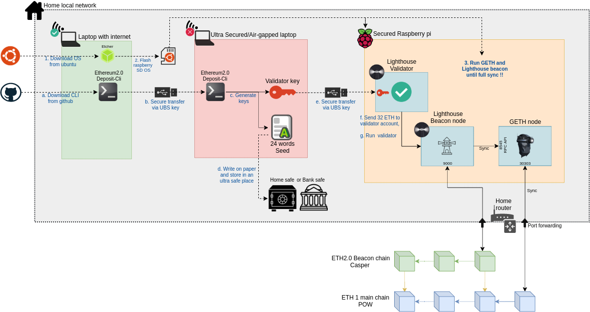

# eth2-staking on raspberry
> Ethereum 2.0 staking with lighthouse client, a secure setup on raspberry pi 4

> **warning**: this guide is for testnet only, mainnet require for now more power CPU, RAM to be to sync Beacon chain, specially when no finality can be reach...

**Your takeaways from this post**
- Implement a client (lighthouse) to stake Ethereum
- Which infrastructure to get to stake at home: rapsberry, harddrive, internet connection
- A setup to obtain high security for your funds
- Some basic monitoring and steps to fix commum issues

## Introduction

Ethereum 1.x is migrating to [Ethereum 2.0](https://ethereum.org/en/eth2/) in few months (before 2021 hopefully), starting with [Phase 0](https://ethereum.org/en/eth2/#roadmap).
This first upgrade will enable [proof of stake](https://ethereum.org/en/eth2/#proof-of-stake). It means you will be able to lock your ETH1 in order to validate the Ethereum 2.0 network and win rewards for that: `ROI = 4 to 22%`, depending on the number of ETH1 staked., following this distribution:




## Staking requisites

In order to stake, you will need:
- 32 ETH (a minimum in order to start staking, a multiple of 32ETH if you want to stake more)
- An Ethereum 1.0 nodes to access blocks:
  - [geth](https://geth.ethereum.org/): the most popular client in GoLang
  - [parity / openEtherem](https://www.parity.io/ethereum/): great alternative in Rust 
  - [Nethermind](https://nethermind.io/): .NET version, for enterprise mainly (new)
  - [Besu](https://www.hyperledger.org/use/besu): Java version (new)
  - Or a connection to a third party service like [infura](https://infura.io/)
- A staking ETH2 client: 
  - [Prism](https://github.com/prysmaticlabs/prysm): GoLand (most used)
  - [Lighthouse](https://github.com/sigp/lighthouse): Rust version (lighter and great alternative)
  - [Nimbus](https://our.status.im/tag/nimbus/): using Nim code, from Status.io team
  - [Teku](https://pegasys.tech/teku/): Java, for enterprise mainly


## Our secure infrastructure

I tried to describe below the different components and steps to enable staking.


- **A laptop with internet** (in green): this is a simple PC to download packages from internet, build the raspberry OS, and read this documentation
- **An ultra secured/air gapped laptop** (in red): this critical laptop needs to be trusted (don't use any PC you browsed internet in the past with) as it will generate all the keys for staking. It could be our raspberry pi with another SD that you will format again when the keys are done
- **Hardware**: a simple raspberry + SSD is enough to run all the infra (at least in testnet...).
- **Internet connection**: we can run everything from our house, as long as you have a good internet connection (speed and reliability)
- **ETH2 Staking client**: in our setup, we choose Lighthouse because Prysm represents [99%](https://eth2.ethernodes.org/network/Medalla) of the nodes on the medalla testnet, and we need client diversity in case of a bug, so the validation could continu on another version of the client.
- **ETH1 node**: we are using Geth for the Ethereum 1 node

### Hardware

| Item | Price in $ | Description |
|------|------------|-------------|
| [Raspberry 4 model B](https://www.raspberrypi.org/products/raspberry-pi-4-model-b/)| 90| New version are still cheap and powerfull enought to run all the infra. We opted for the 8GB version ($90). The 4GB could be enough ($60), but considering the price difference, it is good to have more RAM in case (specially when mainnet). For the OS storage, choose a 16GB SD card class 10.
| [External SSD Samsung T7 1TB](https://www.digitec.ch/en/s1/product/samsung-portable-t7-black-1000gb-external-ssd-13199902?tagIds=76-535)| 177| It will store blockchains data. Geth and Lighthouse will read/write a lot, and the raspberry SD card is not made to handle such a load. 500TB could be enough, but I did not want to be bothered if the disk get full in 1 or 2 years. Today ETH1 data take ~300GB already.
| [Flirc raspberry case](https://www.digitec.ch/en/s1/product/sertronics-flirc-housing-electronics-supplies-casing-12241821) | 34 | Running a staking node will use 100% of your CPU, specially in the begining where data will sync. Temperature in my default case [OKDO](https://www.digitec.ch/en/s1/product/okdo-raspberry-pi-4-model-b-case-housing-electronics-supplies-casing-11268337) was 76°C, but raspberry should run under 70°C to not loose performance. I had to change for a [Flirc case](https://www.digitec.ch/en/s1/product/sertronics-flirc-housing-electronics-supplies-casing-12241821) to get 62°C. This is perfect, as no fan noise or maintenance will be needed.


## Raspberry OS

### OS flashing
We will install ubuntu 20.04 on our raspberry:
- Download the latest image ubuntu [website](https://ubuntu.com/download/raspberry-pi)
- Flash the raspberry SD card using (for example) [etcher](https://www.balena.io/etcher/)

### OS configuration
- Plug the SD card in the raspberry, connect all cable and switch on (default user is `ubuntu`, password is `ubuntu`). 
- At this point you should see the local home IP and you can connect to the pi from your home laptop (on the same wifi): `ssh ubuntu:ubuntu@192.168.xx.xx`
- Activate ssh if last step failed:
```
sudo systemctl enable ssh
sudo systemctl start ssh
```
- Change root password: `sudo passwd root`
- Delete default account: 
```
su root
sudo deluser ubuntu
sudo deluser -remove-home ubuntu
```
- Add new user: `sudo adduser eth`
- Update this OS: `sudo apt-get update -y && apt-get upgrade -y`
- Change hostname (for ex: "ethnode"): `/etc/hostname `
- Configure SSH to use your public keys to access the pi (you should have one for security, check [here](https://serverpilot.io/docs/how-to-use-ssh-public-key-authentication/))
```
su eth
cd
mkdir .ssh
echo "ssh-rsa MY_PUB_KEY_GOES_HERE me@mylaptop" >> ~/.ssh/authorized_keys
```
- Configure ssh config to use a ramdom port (ex:31234) and disable ssh with password (only public key then)
```
sudo nano /etc/ssh/sshd_config
	port 31234
	PasswordAuthentication no 
sudo systemctl restart ssh
```

Test a ssh connection with: `echo "ssh eth@192.168.xx.xx -p31234"`

### Firewall
We will block everything, except:
- 31234: ssh
- 9000: Lighthouse
- 30303: Geth

```
su root
sudo apt install -y ufw
sudo ufw status
sudo ufw default allow outgoing
sudo ufw default deny incoming
sudo ufw limit 31234/tcp
sudo ufw limit 9000/tcp
sudo ufw limit 30303/tcp
sudo ufw status verbose
sudo ufw enable
```

### Home router configuration
You should be able to connect to your router to:
- Always use the same local IP for raspberry: check `Reservation IP <> MAC`
- Port forward your router [public IP](https://whatismyipaddress.com/) port 9000 and 30303 to your local raspberry IP on the same ports.

### SSD external disk

- Connect to your raspberry your SSD external disk (samsumg T7) and run the following
```
sudo fdisk -l
sudo mkfs.ext4 /dev/sda
sudo mkdir /mnt/ssd
sudo mount /dev/sda /mnt/ssd
sudo chown -R eth:eth /mnt/ssd/
sudo blkid
sudo vi /etc/fstab
UUID=5c3a8481-682c-4834-9814-17dba166f591 /mnt/ssd ext4 defaults 0 0
```
More info [here](https://kauri.io/running-an-ethereum-full-node-on-a-raspberrypi-4-m/9695fcca217f46feb355245275835fc0/a).

- Use SSD space for the OS swap
```
sudo fallocate -l 8G /mnt/ssd/swapfile
sudo chmod 600 /mnt/ssd/swapfile
ls -lh /mnt/ssd
sudo mkswap /mnt/ssd/swapfile 
sudo swapon /mnt/ssd/swapfile 
sudo swapon --show
free -h
sudo cp /etc/fstab /etc/fstab.bak
echo '/mnt/ssd/swapfile none swap sw 0 0' | sudo tee -a /etc/fstab
sudo cat /etc/fstab
```

## Geth (ETH1 network)

### Install Golang
```
su root
mkdir ~/Download
cd ~/Download
wget https://golang.org/dl/go1.15.2.linux-arm64.tar.gz
sudo tar -C /usr/local -xvf go1.15.2.linux-arm64.tar.gz
sudo chown root:root /usr/local/go
sudo chmod 755 /usr/local/go
sudo vi /etc/profile
export PATH=$PATH:/usr/local/go/bin
reboot
go version
```

### Install Geth

- Download and build Geth
```
su root
git clone https://github.com/ethereum/go-ethereum.git --branch v<version>
cd go-ethereum
make geth
(wait a couple of minutes...)

sudo mv ~/go-ethereum/build/bin/geth /usr/local/bin
geth version 
```

- Check Geth
```
sudo mkdir /mnt/ssd/ethereum
sudo chown -R eth:eth /mnt/ssd/ethereum
geth --syncmode fast --cache 256 --datadir /mnt/ssd/ethereum
Ctrl+C to stop it
rm -rf /mnt/ssd/ethereum/*
```

- Configure Systemctl to run Geth (--cache depend of your available RAM)
```
sudo vi /etc/systemd/system/geth.service
[Unit]
Description=Geth Node
After=network.target auditd.service
Wants=network.target
[Service]
WorkingDirectory=/home/eth
ExecStart=/usr/local/bin/geth --syncmode fast --cache 2048 --datadir /mnt/ssd/ethereum
User=eth
Group=eth
Restart=always
RestartSec=5s

[Install]
WantedBy=multi-user.target
Alias=geth.service

(for goerli testnet use:

[Unit]
Description=Geth Node
After=network.target auditd.service
Wants=network.target
[Service]
WorkingDirectory=/home/eth
ExecStart=/usr/local/bin/geth --syncmode fast --cache 256 --datadir /mnt/ssd/ethereum --goerli --port 30304 --http
User=eth
Group=eth
Restart=always
RestartSec=5s

[Install]
WantedBy=multi-user.target
Alias=geth.service

sudo systemctl daemon-reload
sudo systemctl enable geth
sudo systemctl start geth
```
- Check logs:
```
journalctl -u geth -e
or
tail -f /var/log/syslog 
```

### Geth metrics

Few simple step to collect and visualize Geth performance in a google sheet:
```
crontab -e
*/15 * * * * echo $(date --iso-8601=seconds)\;$(/usr/local/bin/geth --verbosity 0 --datadir /mnt/ssd/ethereum/ --exec 'var a = admin.peers; var s = eth.syncing; s.currentBlock + ";" + s.highestBlock + ";" + (s.highestBlock-s.currentBlock) + ";" + s.pulledStates + ";" + s.knownStates + ";" + a.length' attach | tr -d "\"")\;$(df /dev/sda --output=used | sed -n 2p)\;$(iostat /dev/sda -d -x | awk {'print $4";"$5";"$16'} | sed -n 4p)\;$(free | awk {'print $3";"$2'} | sed -n 2p)\;$(free | awk {'print $3";"$2'} | sed -n 3p)\;$(cat /proc/loadavg | awk {'print $1";"$2";"$3'})\;$(iostat -c | sed -n 4p | awk {'print $1'})\;$(cat /sys/devices/virtual/thermal/thermal_zone?/temp | sed -n 1p | awk '{ print $1/1000 }') >> /home/eth/geth_metrics.csv

scp -P31234 eth@192.168.xx.xx:/home/eth/geth_metrics.csv ~/Downloads/geth_metrics.csv
```

Open a [google sheet](https://docs.google.com/spreadsheets/d/1lxJ5_v3ozJ7YbN1JlglYvF7x8ssRsPLOrxSIX-obvow/edit#gid=0) to import the data. More info [here](https://kauri.io/monitor-your-geth-node-with-google-sheet/5ab5c4d558e04a73accebc652ef2246b/a
).


## Validator key to store the 32 ETH

It is a good practive to open the [launchpad](https://medalla.launchpad.ethereum.org/) and read about the process.

### Create the seed

The most critical part is to create the validator key which will receive the funds (32+ ETH) and will validate block.

- Format a fresh USB stick to download the latest deposit CLI from [the official repository](https://github.com/ethereum/eth2.0-deposit-cli/releases/) (double check this link from this official documentation!!)
- **On the secure and air-gapped laptop/raspberry**: connect the USB stick to get the CLI, and run the command: 
```
./deposit --num_validators 1 --chain medalla
```
- You should provide a `keystore password` and the cli should output a seed like
```
cabbage garden word3 word4 .... word24
```
- And a directory structure like:
```
/home/myuser/Documents/eth2/validator_keys/validator_keys/
    |   deposit_data-1602056423.json                  # public key = the ETH address where you will send the 32 ETH (ok to share)
    |   keystore-m_12381_3600_0_0_0-1602056423.json   # private key (critical, do not share!!)

```
- Copy the `seed` and the `keystore password` on a piece of paper and keep it safe, this paper is CRITICAL as it contains the keys to recover the 32 ETH.
- Copy on your USB stick the validator keys located here: `/home/myuser/Documents/eth2/validator_keys`, and transfer them to the raspberry.

### Deposit 32 ETH

Follow again the [launchpad](https://medalla.launchpad.ethereum.org/), go to the section to deposit the 32 ETH. You should need to provide the file `deposit_data-1602056423.json` from your USD stick.

Send 32 ETH (Goerli testnet). **Do not send mainnet ETH, please check 3 times!**


## Lighthouse (staking client)

### Install client
- Get lighthouse (check the latest version!):
```
cd ~/Download/
wget https://github.com/sigp/lighthouse/releases/download/v0.3.0/lighthouse-v0.3.0-aarch64-unknown-linux-gnu.tar.gz
tar -xvf lighthouse-v0.3.0-aarch64-unknown-linux-gnu.tar.gz
./lighthouse --version
cp lighthouse /usr/bin
lighthouse --version
```
- Import launchpad key (more info [here](https://lighthouse-book.sigmaprime.io/validator-import-launchpad.html
))
```
lighthouse --testnet medalla account validator import --directory validator_keys
```

### Run beacon node
- Try to run beacon node (with data on SSD disk, and using infura as a source for the goerli network)
```
mkdir /mnt/ssd/lighthouse
lighthouse --testnet medalla beacon --staking --datadir /mnt/ssd/lighthouse --eth1-endpoint https://goerli.infura.io/v3/b552374a068f467a9a7382d4ef7dee95
```
- if everything went went for 3 minutes, stop lighthouse ctrl+C and delete the folder `rm -r /mnt/ssd/lighthouse`

- Use Systemctl to run lighthouse (--cache depend of your available RAM)
```
sudo vi /etc/systemd/system/beacon.service
[Unit]
Description=Beacon Node
After=network.target auditd.service
Wants=network.target
[Service]
WorkingDirectory=/home/eth
ExecStart=lighthouse --testnet medalla beacon --staking --datadir /mnt/ssd/lighthouse --eth1-endpoint https://goerli.infura.io/v3/b552374a068f467a9a7382d4ef7dee95
User=eth
Group=eth
Restart=always
RestartSec=5s

[Install]
WantedBy=multi-user.target
Alias=beacon.service
```

- Run lighthouse
```
sudo systemctl daemon-reload
sudo systemctl enable beacon
sudo systemctl start beacon
```

- Check logs:
```
journalctl -u beacon -e
or
tail -f /var/log/syslog 
```

## Run validator:

In progress...

```
lighthouse --testnet medalla validator --auto-register
```


## Annexes

### Sync nodes

#### ETH1: Geth

Monitor sync:
```
/usr/local/bin/geth --datadir /mnt/ssd/ethereum attach --exec eth.syncing
```
Explanation:
```
- StartingBlock: Block number where sync began
- CurrentBlock: Current block number where sync is at
- HighestBlock: Highest alleged block number in the chain
- PulledStates: Number of state trie entries already downloaded
- KnownStates: Total number os state trie entries known about
```

Status:
- Started: 12 Oct, need to reach:
  - [Block](https://etherscan.com/) 11 093 776
  - States: 785 813 881 ?? (no dynamic page list the max states so far)
  - 21 Oct: 637 995 425

#### ETH2 beacon: lighthouse

Monitoring sync:
```
journal -u beacon -ef
```

Status:
- Started: 15 Oct, need to reach 
  - [block](https://beaconscan.com/) 560872, 
  - 21 Oct: 558822


### Check temp on raspberry
```
sudo apt install lm-sensors hddtemp
watch -n 2 sensors
```